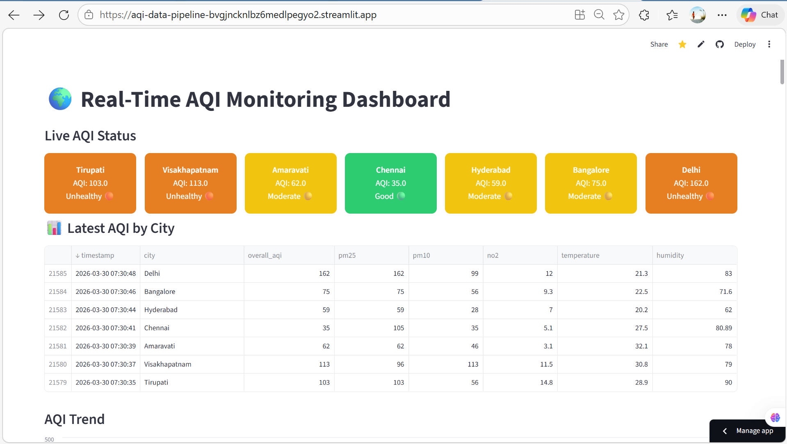
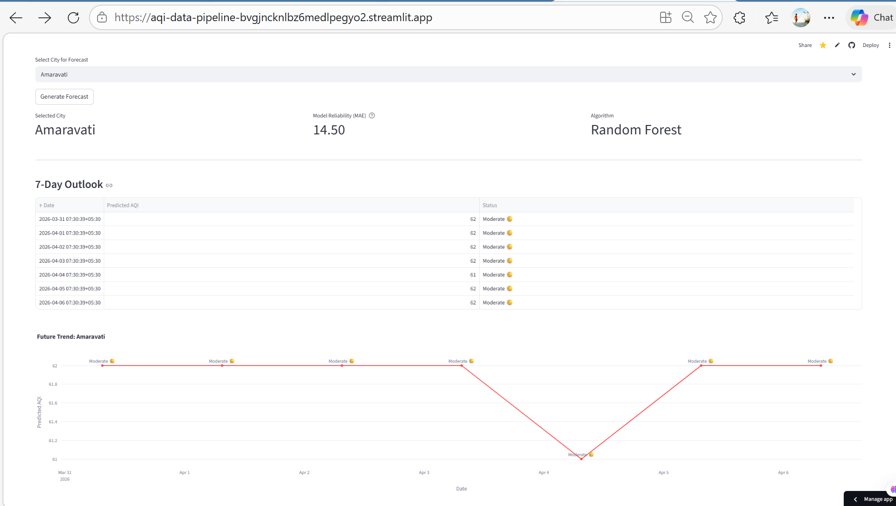
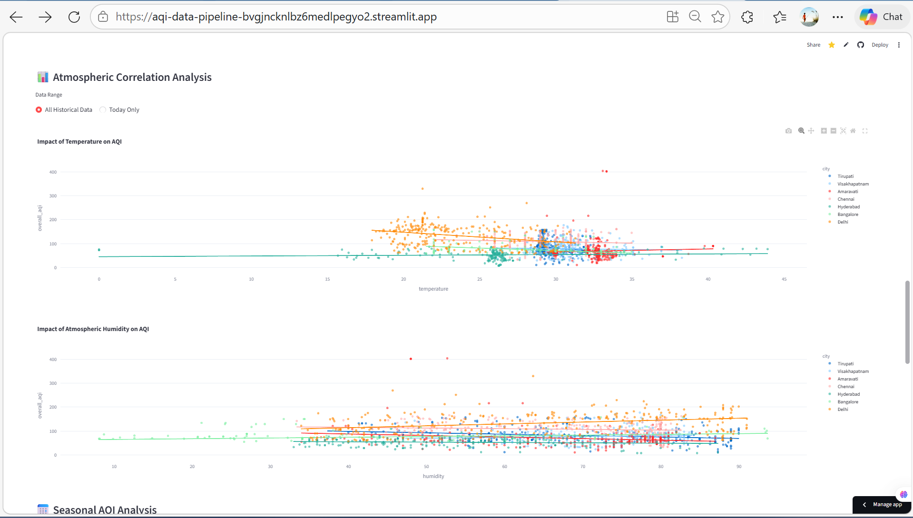

# 🌍 Advanced AQI Data Pipeline & Predictive Analytics
> **Live Dashboard:** [https://aqi-data-pipeline-bvgjncknlbz6medlpegyo2.streamlit.app/]  
> **Target Impact:** Real-time environmental monitoring and 7-day atmospheric forecasting.

## 📌 Project Overview
This project is a full-stack Data Science pipeline that ingests real-time Air Quality Index (AQI) data via the WAQI API, processes it through a cloud-based PostgreSQL database, and utilizes **Machine Learning (Random Forest)** to provide 7-day predictive insights.

## 🧠 Key Technical Innovation: The Forecast Engine
Unlike standard dashboards that only show past data, this system features a **Recursive Sliding Window Forecast**:
* **Model:** RandomForestRegressor (Scikit-Learn).
* **Feature Engineering:** Incorporates temporal features (Day of Week) and historical AQI lags (Window Size: 5).
* **Validation:** Real-time **Mean Absolute Error (MAE)** calculation to provide transparency on model reliability.

## 🚀 Core Features
* 🔮 **7-Day Predictive Outlook:** Dynamic forecasting that adapts to recent local trends.
* 🌍 **Multi-City Live Monitoring:** Instant AQI status for major cities (Amaravati, Tirupati, etc.).
* 📊 **Multivariate Analysis:** Correlation tracking between Temperature, Humidity, and Pollution levels.
* 🔄 **Automated ETL Pipeline:** GitHub Actions triggers a Python-based ETL every hour to keep the Supabase (PostgreSQL) instance current.

## 🛠 Tech Stack
* **Language:** Python (Pandas, NumPy)
* **Machine Learning:** Scikit-Learn (Random Forest)
* **Visualization:** Plotly Express & Streamlit
* **Database:** Supabase (PostgreSQL)
* **DevOps:** GitHub Actions for automated data ingestion
* **Deployment:** Streamlit Cloud

## ⚙️ Architecture & Data Flow
1.  **Ingestion:** Python scripts fetch JSON data from the WAQI API.
2.  **Storage:** Data is cleaned and pushed to a **Supabase** cloud database.
3.  **Processing:** The application pulls historical records and performs "Sliding Window" transformations.
4.  **Inference:** The Random Forest model generates a 7-day recursive forecast.
5.  **UI:** Results are rendered into an interactive dashboard for end-user exploration.

## 📈 Performance Metrics
The model currently operates with a **Mean Absolute Error (MAE)** of approximately `16.5`, providing a highly reliable trend analysis for urban planning and public health awareness.
### 🛠️ Data Sanitization Layer
To ensure the integrity of the Predictive Models, the pipeline implements a 
strict "Physical Constraint Filter." This handles real-world sensor glitches, 
such as the 393,275°C temperature anomaly detected at the Hyderabad station.

```python
# Filtering out non-physical sensor anomalies before training
df = df[(df['temperature'] >= -10) & (df['temperature'] <= 60)]
df = df[(df['humidity'] >= 0) & (df['humidity'] <= 100)]
df = df[(df['overall_aqi'] >= 0) & (df['overall_aqi'] <= 500)]

## 🌟 Future Roadmap
- [ ] **Satellite Data Integration:** Merging ground-station AQI with Sentinel-5P satellite imagery (IIRS/VSSC focus).
- [ ] **Deep Learning Migration:** Implementing LSTM (Long Short-Term Memory) networks for improved long-term temporal dependencies.
- [ ] **Automated Alerts:** Email/SMS triggers when AQI crosses the 'Hazardous' threshold (200+).
## Screenshots



## 📸 System Insights

| 🔮 7-Day Predictive Analytics | 🌡️ Multivariate Correlations |
| :---: | :---: |
|  |  |
| *Recursive Random Forest Forecast* | *OLS Regression: Temp/Humidity vs AQI* |
---
**Developed by:** MORAVANENI AISWARYA LAKSHMI  
*B.Tech CSE (Data ) @ SVCE Tirupati*
